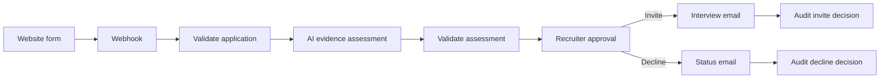

# n8n Lagos Careers — Workshop Starter

A participant-ready version of the **Automating an HR Workflow with n8n** practical session. It demonstrates a complete recruitment workflow:

1. A candidate submits the public careers form.
2. n8n validates and normalizes the application.
3. An AI model produces a structured, job-related evidence summary.
4. A recruiter reviews the summary and approves or declines.
5. n8n sends the appropriate applicant email and records an audit output.

> This repository contains no API keys, OAuth tokens, credential IDs, personal inboxes, or live webhook URLs. You must connect your own services after importing it.

## Repository structure

```text
.
├── frontend/
│   ├── index.html
│   └── README.md
├── workflow/
│   ├── n8n-lagos-hr-workflow.json
│   └── README.md
├── sample-data/
│   └── sample-candidates.csv
└── .gitignore
```

## Prerequisites

- An n8n Cloud workspace or a publicly reachable self-hosted n8n instance
- An OpenAI credential supported by n8n
- A Gmail OAuth credential
- A static web host, or a local HTTP server for testing

Use fictional candidate information during the workshop. Do not submit real CVs, identity documents, health information, photographs, home addresses or other sensitive data.

## 1. Import the n8n workflow

1. Download or clone this repository.
2. In n8n, select **Create Workflow** → **Import from File**.
3. Import `workflow/n8n-lagos-hr-workflow.json`.
4. Open **OpenAI Chat Model** and select your own OpenAI credential.
5. Open all three Gmail nodes and select your own Gmail credential:
   - `Recruiter Approval`
   - `Send Interview Invite`
   - `Send Status Update`
6. In `Recruiter Approval`, replace `REPLACE_WITH_RECRUITER_EMAIL` with the reviewer's email address.
7. Save and publish the workflow.
8. Open the `Webhook` node and copy its **Production URL**.

See [workflow/README.md](workflow/README.md) for the workflow map and troubleshooting notes.

## 2. Connect the frontend

The frontend intentionally ships without a webhook URL.

For a quick workshop test, open the page once using:

```text
https://YOUR-FRONTEND-URL.example/?webhook=PASTE_YOUR_ENCODED_N8N_PRODUCTION_URL_HERE#apply
```

The page saves that URL in browser session storage. Alternatively, edit `frontend/index.html` and set:

```js
const productionWebhook = 'https://YOUR-N8N-HOST/webhook/YOUR-WEBHOOK-PATH';
```

Do not commit a private or production webhook URL to a public repository.

See [frontend/README.md](frontend/README.md) for local preview and hosting instructions.

## 3. Test the complete flow

1. Open the careers page.
2. Submit one of the fictional profiles in `sample-data/sample-candidates.csv`.
3. Confirm an n8n execution starts.
4. Confirm the execution reaches **Recruiter Approval** and waits.
5. Open the recruiter email and select an outcome.
6. Confirm the candidate receives the corresponding formatted email.
7. Confirm the execution finishes at the matching audit node.

## Workflow overview



## Responsible-use notes

- The AI output is advisory; a human remains responsible for every progression decision.
- The prompt instructs the model to use job-related evidence only.
- Do not infer or score protected characteristics.
- Review the role criteria before reusing the workflow for another vacancy.
- Add durable audit storage before using this pattern beyond a demonstration.
- Check your organization's privacy, employment and AI-governance requirements.

## Troubleshooting

- **Website says submitted but no execution appears:** ensure the workflow is published and the frontend uses the Production URL, not the Test URL.
- **Webhook method error:** the Webhook node must use `POST`.
- **Consent error:** the validation node accepts `true`, `"true"` and `"on"`.
- **Execution stops at Gmail:** confirm all Gmail nodes have a valid OAuth credential.
- **No approval email:** confirm the recruiter address was replaced and check spam.
- **AI node fails:** select a model available to your credential and n8n version.

## License and reuse

This workshop starter is intended for educational reuse. Adapt the role, wording, criteria and branding before using it for another organization.
